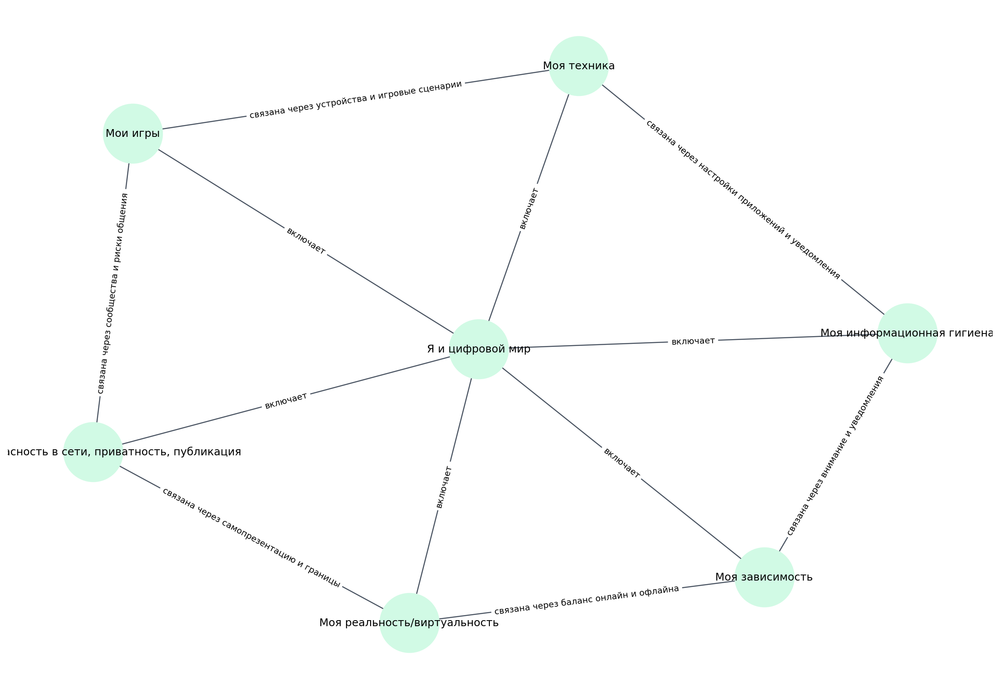

# Раздел 6. Я и цифровой мир

> Черновой шаблон репозитория под командный проект.  
> Этот README сделан как шаблон: блоки про участников, роли и личные впечатления можно заполнить позже.

## 1. Кто работал над разделом

| Участник | Роль | Что делал | Статус |
|---|---|---|---|
| [Имя 1] | [Капитан / аналитик / редактор / разработчик / визуализатор] | [Кратко описать вклад] | [заполнить] |
| [Имя 2] | [Роль] | [Кратко описать вклад] | [заполнить] |
| [Имя 3] | [Роль] | [Кратко описать вклад] | [заполнить] |
| [Имя 4] | [Роль] | [Кратко описать вклад] | [заполнить] |
| [Имя 5] | [Роль] | [Кратко описать вклад] | [заполнить] |

## 2. Что входит в раздел

- `moya_zavisimost` — **Моя зависимость**: Тема о внимании, экранном времени, привычках и цифровой перегрузке.
- `moi_igry` — **Мои игры**: Тема об играх как хобби, развлечении, спорте и среде общения.
- `moya_informacionnaya_gigiena` — **Моя информационная гигиена**: Тема о фейках, источниках, алгоритмах рекомендаций и медиаграмотности.
- `moya_bezopasnost_v_seti` — **Моя безопасность в сети, приватность, публикация**: Тема о личных данных, приватности, цифровом следе и безопасном поведении онлайн.
- `moya_realnost_i_virtualnost` — **Моя реальность/виртуальность**: Тема об онлайн- и офлайн-жизни, самопрезентации и FOMO.
- `moya_tehnika` — **Моя техника**: Тема о выборе устройств, уходе за техникой, ремонте и апгрейде.

## 3. Общая логика раздела

Раздел **«Я и цифровой мир»** собран вокруг идеи, что цифровая среда — это не только техника и интернет, но и:
- внимание,
- привычки,
- игры,
- информация,
- безопасность,
- самопрезентация,
- баланс онлайн- и офлайн-жизни.

В черновом варианте мы разделили весь раздел на 6 подтем. Каждая подтема получила:
- свой `README.md`,
- свой `concepts.json`,
- черновую схему связей `images/ontology.png`,
- файл с примерами SPARQL-запросов,
- черновой файл с примером структуры выгрузки.

## 4. Схема связей между темами

Ниже ссылка на общую схему раздела:

Кратко:
- **Моя зависимость** связана с темой информационной гигиены через внимание, уведомления и привычки.
- **Мои игры** пересекаются с безопасностью в сети и темой техники.
- **Моя безопасность в сети** связана с виртуальной личностью, цифровым следом и публикацией.
- **Моя реальность/виртуальность** соединяет поведение в сети, общение и FOMO.
- **Моя техника** поддерживает все остальные темы как материальная и программная основа цифровой жизни.

## 5. Как устроен репозиторий

- `WORK/ya_i_cifrovoy_mir/README.md` — общий шаблон отчёта по разделу.
- `WORK/ya_i_cifrovoy_mir/concepts.json` — общий список тем и статей по разделу.
- `WORK/ya_i_cifrovoy_mir/scripts/insert_crosslinks.py` — черновой скрипт для простановки перекрёстных ссылок.
- `WORK/ya_i_cifrovoy_mir/<topic>/...` — рабочие материалы по каждой теме.
- `WEB/ya_i_cifrovoy_mir/<topic>/concepts/*.md` — markdown-страницы для будущей детской энциклопедии.

## 6. Процесс работы (черновик)

1. Выделили 6 подтем внутри раздела.
2. Для каждой подтемы определили будущие статьи и ключевые понятия.
3. Намечены горизонтальные и иерархические связи между понятиями.
4. Подготовлены шаблоны README, структуры данных и тексты статей-черновиков.
5. Добавлен черновой скрипт для перекрёстных ссылок.
6. Следующий этап — уточнить понятия через WikiData / DBpedia и заменить примерные выгрузки реальными результатами запросов.

## 7. Какие инструменты планируется использовать

- WikiData
- DBpedia
- SPARQL
- Python
- Markdown
- Генеративная модель для черновиков статей
- Git / Pull Request

## 8. Что ещё нужно доделать

- [ ] Заполнить участников и роли
- [ ] Проверить и уточнить состав статей
- [ ] Выполнить реальные SPARQL-запросы и обновить `data/`
- [ ] При необходимости дорисовать онтологию вручную
- [ ] Проставить итоговые перекрёстные ссылки между статьями
- [ ] Отредактировать тексты под единый стиль

## 9. Личные ощущения от работы

> Здесь можно оставить короткие впечатления команды:
>
> - [Имя]: ...
> - [Имя]: ...
> - [Имя]: ...
