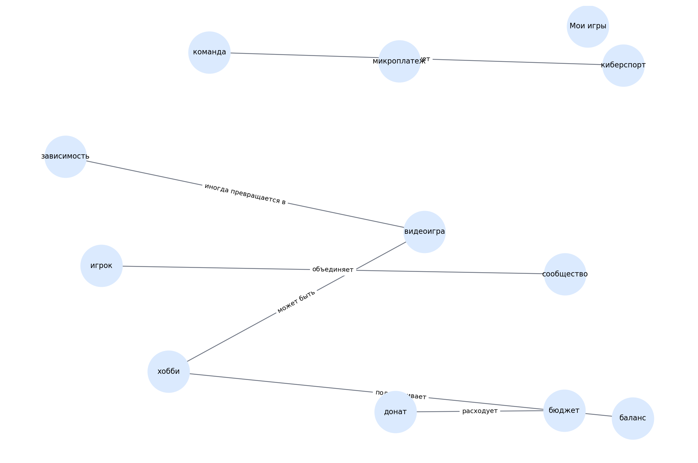

# Мои игры

> Черновой шаблон README для темы. Блок «кто делал» оставлен под заполнение вручную.

## 1. Кто работал над темой

| Участник | Роль | Что делал | Статус |
|---|---|---|---|
| [Имя 1] | [Капитан / аналитик / редактор / разработчик / визуализатор] | [Кратко описать вклад] | [заполнить] |
| [Имя 2] | [Роль] | [Кратко описать вклад] | [заполнить] |
| [Имя 3] | [Роль] | [Кратко описать вклад] | [заполнить] |
| [Имя 4] | [Роль] | [Кратко описать вклад] | [заполнить] |
| [Имя 5] | [Роль] | [Кратко описать вклад] | [заполнить] |

## 2. О чём эта тема

Тема об играх как хобби, развлечении, спорте и среде общения.

Ключевые слова:
игры, киберспорт, донаты, сообщества, хобби

## 3. Какие статьи входят в тему

- `igry_hobbi_ili_zavisimost.md` — Игры — это зависимость или хобби
- `kibersport_kak_stat_professionalom.md` — Киберспорт: как стать профессионалом
- `igrovye_soobshchestva.md` — Игровые сообщества: друзья на всю жизнь
- `donaty_i_mikroplatezhi.md` — Донаты и микроплатежи — стоит ли тратить
- `chem_zamenit_igry_esli_nadoelo.md` — Чем заменить игры, если надоело

## 4. Схема связей внутри темы

Текстовое описание:
- **видеоигра** → **хобби** (может быть)
- **видеоигра** → **зависимость** (иногда превращается в)
- **киберспорт** → **команда** (требует)
- **сообщество** → **игрок** (объединяет)
- **донат** → **бюджет** (расходует)
- **баланс** → **хобби** (поддерживает)

## 5. Связи с другими темами раздела

- Я и цифровой мир — входит в раздел
- Моя безопасность в сети, приватность, публикация — связана через сообщества и риски общения
- Моя техника — связана через устройства и игровые сценарии

## 6. Примеры запросов

Файл с запросами: `scripts/sparql_queries.py`

Ниже — черновые направления запросов:
- `video game`
- `esports`
- `online community`
- `microtransaction`
- `gaming`

## 7. Где лежат рабочие материалы

- `concepts.json` — список статей и ключевых понятий темы
- `images/ontology.png` — схема темы
- `scripts/sparql_queries.py` — черновые SPARQL-запросы
- `data/wikidata_export.json` — шаблон выгрузки, который нужно заменить реальными данными

## 8. Процесс работы

1. Выделена тема внутри раздела.
2. Составлен первичный список статей.
3. Выделены основные понятия и связи.
4. Подготовлены черновые тексты.
5. Подготовлены шаблоны запросов и место под выгрузку.

## 9. Что ещё нужно уточнить

- [ ] Проверить состав статей
- [ ] Выполнить запросы к WikiData / DBpedia
- [ ] При необходимости изменить связи
- [ ] Добавить изображения, примеры и ссылки в тексты
- [ ] Вычитать стиль для возраста 10+

## 10. Личные ощущения от работы

> Заполнить после завершения этапа:
>
> - [Имя]: ...
> - [Имя]: ...
> - [Имя]: ...
