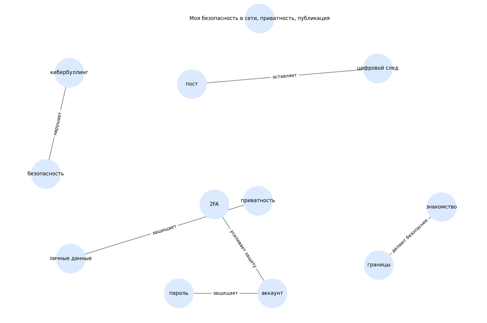

# Моя безопасность в сети, приватность, публикация

> Черновой шаблон README для темы. Блок «кто делал» оставлен под заполнение вручную.

## 1. Кто работал над темой

| Участник | Роль | Что делал | Статус |
|---|---|---|---|
| [Имя 1] | [Капитан / аналитик / редактор / разработчик / визуализатор] | [Кратко описать вклад] | [заполнить] |
| [Имя 2] | [Роль] | [Кратко описать вклад] | [заполнить] |
| [Имя 3] | [Роль] | [Кратко описать вклад] | [заполнить] |
| [Имя 4] | [Роль] | [Кратко описать вклад] | [заполнить] |
| [Имя 5] | [Роль] | [Кратко описать вклад] | [заполнить] |

## 2. О чём эта тема

Тема о личных данных, приватности, цифровом следе и безопасном поведении онлайн.

Ключевые слова:
приватность, кибербуллинг, посты, след, знакомства

## 3. Какие статьи входят в тему

- `chto_mozhno_i_nelzya_postit.md` — Что можно и нельзя постить
- `kiberbulling.md` — Кибербуллинг: что делать, если травят
- `opasnye_znakomstva_v_seti.md` — Опасные знакомства в сети
- `nastroyki_privatnosti.md` — Настройки приватности: как защититься
- `cifrovoi_sled.md` — Цифровой след: увидят ли внуки мои фото

## 4. Схема связей внутри темы

Текстовое описание:
- **пост** → **цифровой след** (оставляет)
- **приватность** → **личные данные** (защищает)
- **пароль** → **аккаунт** (защищает)
- **2FA** → **аккаунт** (усиливает защиту)
- **кибербуллинг** → **безопасность** (нарушает)
- **границы** → **знакомство** (делают безопаснее)

## 5. Связи с другими темами раздела

- Я и цифровой мир — входит в раздел
- Мои игры — связана через сообщества и риски общения
- Моя реальность/виртуальность — связана через самопрезентацию и границы

## 6. Примеры запросов

Файл с запросами: `scripts/sparql_queries.py`

Ниже — черновые направления запросов:
- `privacy`
- `personal data`
- `cyberbullying`
- `online safety`
- `digital footprint`

## 7. Где лежат рабочие материалы

- `concepts.json` — список статей и ключевых понятий темы
- `images/ontology.png` — схема темы
- `scripts/sparql_queries.py` — черновые SPARQL-запросы
- `data/wikidata_export.json` — шаблон выгрузки, который нужно заменить реальными данными

## 8. Процесс работы

1. Выделена тема внутри раздела.
2. Составлен первичный список статей.
3. Выделены основные понятия и связи.
4. Подготовлены черновые тексты.
5. Подготовлены шаблоны запросов и место под выгрузку.

## 9. Что ещё нужно уточнить

- [ ] Проверить состав статей
- [ ] Выполнить запросы к WikiData / DBpedia
- [ ] При необходимости изменить связи
- [ ] Добавить изображения, примеры и ссылки в тексты
- [ ] Вычитать стиль для возраста 10+

## 10. Личные ощущения от работы

> Заполнить после завершения этапа:
>
> - [Имя]: ...
> - [Имя]: ...
> - [Имя]: ...
