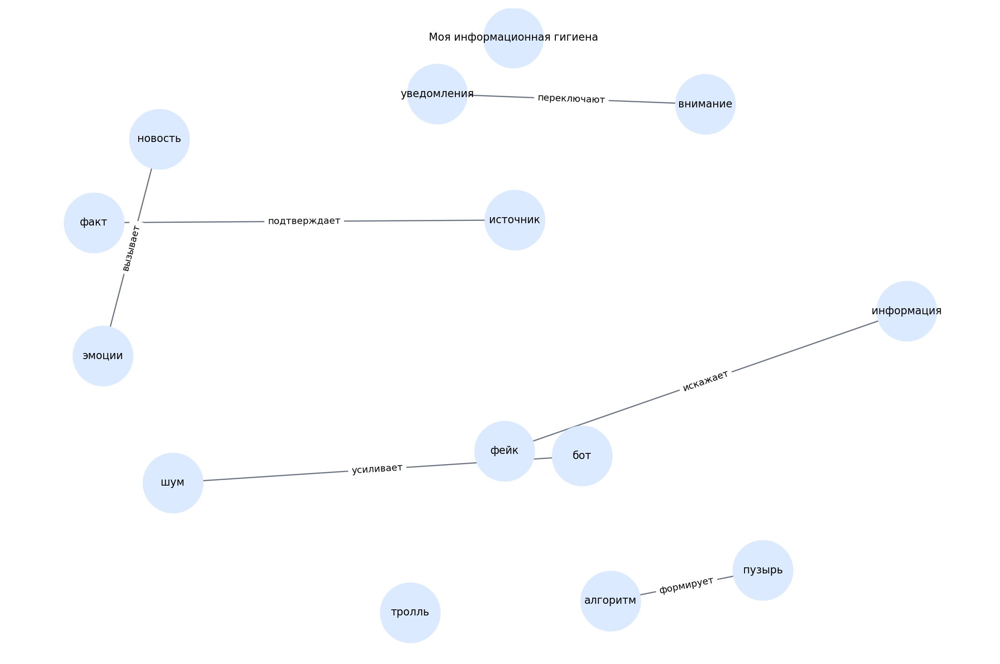

# Моя информационная гигиена

> Черновой шаблон README для темы. Блок «кто делал» оставлен под заполнение вручную.

## 1. Кто работал над темой

| Участник | Роль | Что делал | Статус |
|---|---|---|---|
| [Имя 1] | [Капитан / аналитик / редактор / разработчик / визуализатор] | [Кратко описать вклад] | [заполнить] |
| [Имя 2] | [Роль] | [Кратко описать вклад] | [заполнить] |
| [Имя 3] | [Роль] | [Кратко описать вклад] | [заполнить] |
| [Имя 4] | [Роль] | [Кратко описать вклад] | [заполнить] |
| [Имя 5] | [Роль] | [Кратко описать вклад] | [заполнить] |

## 2. О чём эта тема

Тема о фейках, источниках, алгоритмах рекомендаций и медиаграмотности.

Ключевые слова:
фейк, новости, боты, пузырь, уведомления

## 3. Какие статьи входят в тему

- `kak_otlichit_fejk_ot_pravdy.md` — Как отличить фейк от правды
- `pochemu_novosti_pugayut.md` — Почему новости пугают и что с этим делать
- `informacionnyj_puzyr.md` — Информационный пузырь: почему я вижу только одно
- `kto_takie_boty_i_trolli.md` — Кто такие боты и тролли
- `kogda_nuzhno_vyklyuchat_uvedomleniya.md` — Когда нужно выключать уведомления

## 4. Схема связей внутри темы

Текстовое описание:
- **источник** → **факт** (подтверждает)
- **фейк** → **информация** (искажает)
- **алгоритм** → **пузырь** (формирует)
- **бот** → **шум** (усиливает)
- **уведомления** → **внимание** (переключают)
- **новость** → **эмоции** (вызывает)

## 5. Связи с другими темами раздела

- Я и цифровой мир — входит в раздел
- Моя зависимость — связана через внимание и уведомления
- Моя техника — связана через настройки приложений и уведомления

## 6. Примеры запросов

Файл с запросами: `scripts/sparql_queries.py`

Ниже — черновые направления запросов:
- `fake news`
- `social bot`
- `recommendation system`
- `information bubble`
- `media literacy`

## 7. Где лежат рабочие материалы

- `concepts.json` — список статей и ключевых понятий темы
- `images/ontology.png` — схема темы
- `scripts/sparql_queries.py` — черновые SPARQL-запросы
- `data/wikidata_export.json` — шаблон выгрузки, который нужно заменить реальными данными

## 8. Процесс работы

1. Выделена тема внутри раздела.
2. Составлен первичный список статей.
3. Выделены основные понятия и связи.
4. Подготовлены черновые тексты.
5. Подготовлены шаблоны запросов и место под выгрузку.

## 9. Что ещё нужно уточнить

- [ ] Проверить состав статей
- [ ] Выполнить запросы к WikiData / DBpedia
- [ ] При необходимости изменить связи
- [ ] Добавить изображения, примеры и ссылки в тексты
- [ ] Вычитать стиль для возраста 10+

## 10. Личные ощущения от работы

> Заполнить после завершения этапа:
>
> - [Имя]: ...
> - [Имя]: ...
> - [Имя]: ...
