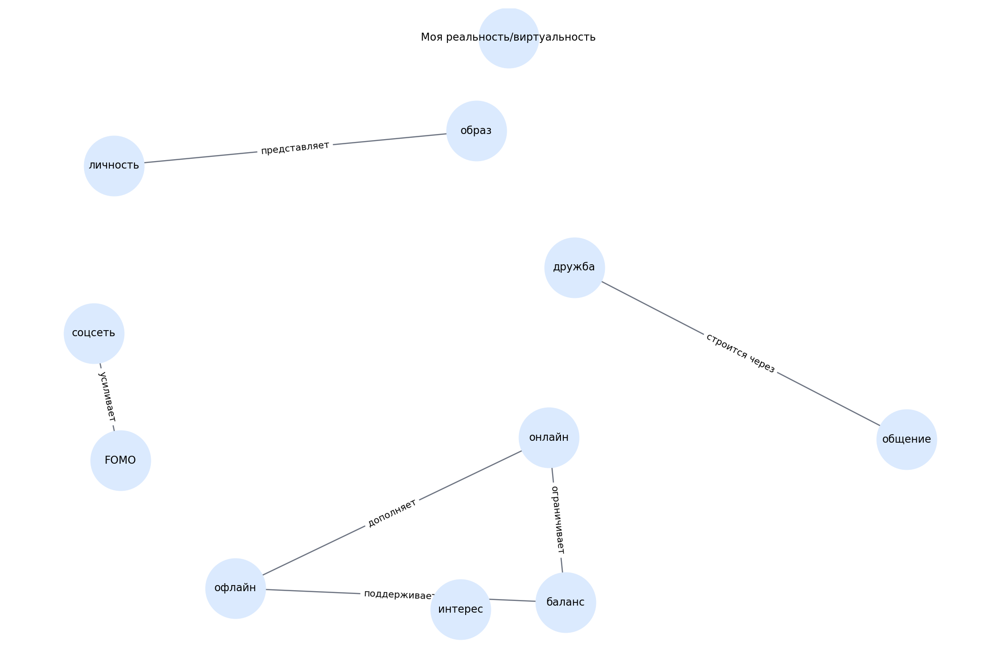

# Моя реальность/виртуальность

> Черновой шаблон README для темы. Блок «кто делал» оставлен под заполнение вручную.

## 1. Кто работал над темой

| Участник | Роль | Что делал | Статус |
|---|---|---|---|
| [Имя 1] | [Капитан / аналитик / редактор / разработчик / визуализатор] | [Кратко описать вклад] | [заполнить] |
| [Имя 2] | [Роль] | [Кратко описать вклад] | [заполнить] |
| [Имя 3] | [Роль] | [Кратко описать вклад] | [заполнить] |
| [Имя 4] | [Роль] | [Кратко описать вклад] | [заполнить] |
| [Имя 5] | [Роль] | [Кратко описать вклад] | [заполнить] |

## 2. О чём эта тема

Тема об онлайн- и офлайн-жизни, самопрезентации и FOMO.

Ключевые слова:
онлайн, оффлайн, личность, FOMO, общение

## 3. Какие статьи входят в тему

- `zhizn_onlayn_i_v_reale.md` — Жизнь в онлайне и в реале — где я больше
- `virtualnaya_lichnost.md` — Виртуальная личность: я или не я
- `znakomstva_v_seti_i_v_zhizni.md` — Знакомства в сети vs в жизни
- `strah_propustit_chto_to_fomo.md` — Страх пропустить что-то (FOMO)
- `kak_druzhit_oflayn_kogda_privyk_online.md` — Как дружить офлайн, когда привык онлайн

## 4. Схема связей внутри темы

Текстовое описание:
- **онлайн** → **офлайн** (дополняет)
- **образ** → **личность** (представляет)
- **соцсеть** → **FOMO** (усиливает)
- **дружба** → **общение** (строится через)
- **баланс** → **онлайн** (ограничивает)
- **баланс** → **офлайн** (поддерживает)

## 5. Связи с другими темами раздела

- Я и цифровой мир — входит в раздел
- Моя безопасность в сети, приватность, публикация — связана через самопрезентацию и границы
- Моя зависимость — связана через баланс онлайн и офлайна

## 6. Примеры запросов

Файл с запросами: `scripts/sparql_queries.py`

Ниже — черновые направления запросов:
- `online identity`
- `social network`
- `friendship`
- `fear of missing out`
- `virtual community`

## 7. Где лежат рабочие материалы

- `concepts.json` — список статей и ключевых понятий темы
- `images/ontology.png` — схема темы
- `scripts/sparql_queries.py` — черновые SPARQL-запросы
- `data/wikidata_export.json` — шаблон выгрузки, который нужно заменить реальными данными

## 8. Процесс работы

1. Выделена тема внутри раздела.
2. Составлен первичный список статей.
3. Выделены основные понятия и связи.
4. Подготовлены черновые тексты.
5. Подготовлены шаблоны запросов и место под выгрузку.

## 9. Что ещё нужно уточнить

- [ ] Проверить состав статей
- [ ] Выполнить запросы к WikiData / DBpedia
- [ ] При необходимости изменить связи
- [ ] Добавить изображения, примеры и ссылки в тексты
- [ ] Вычитать стиль для возраста 10+

## 10. Личные ощущения от работы

> Заполнить после завершения этапа:
>
> - [Имя]: ...
> - [Имя]: ...
> - [Имя]: ...
