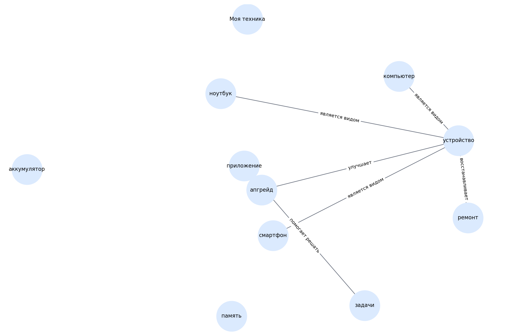

# Моя техника

> Черновой шаблон README для темы. Блок «кто делал» оставлен под заполнение вручную.

## 1. Кто работал над темой

| Участник | Роль | Что делал | Статус |
|---|---|---|---|
| [Имя 1] | [Капитан / аналитик / редактор / разработчик / визуализатор] | [Кратко описать вклад] | [заполнить] |
| [Имя 2] | [Роль] | [Кратко описать вклад] | [заполнить] |
| [Имя 3] | [Роль] | [Кратко описать вклад] | [заполнить] |
| [Имя 4] | [Роль] | [Кратко описать вклад] | [заполнить] |
| [Имя 5] | [Роль] | [Кратко описать вклад] | [заполнить] |

## 2. О чём эта тема

Тема о выборе устройств, уходе за техникой, ремонте и апгрейде.

Ключевые слова:
смартфон, ноутбук, ремонт, апгрейд, приложения

## 3. Какие статьи входят в тему

- `kak_prodlit_zhizn_telefonu_i_noutbuku.md` — Как продлить жизнь телефону/ноутбуку
- `chto_delat_esli_slomalos.md` — Что делать, если сломалось
- `kak_sobrat_igrovoy_komp.md` — Как собрать игровой комп
- `kakaya_tekhnika_nuzhna_v_tvoey_oblasti_interesov.md` — Какая техника нужна в твоей области интересов
- `poleznye_prilozheniya_ne_tolko_igry.md` — Полезные приложения (не только игры)
- `remont_svoimi_rukami.md` — Ремонт своими руками — это реально
- `apgreyd_kogda_pora_menyat.md` — Апгрейд: когда пора менять

## 4. Схема связей внутри темы

Текстовое описание:
- **смартфон** → **устройство** (является видом)
- **ноутбук** → **устройство** (является видом)
- **компьютер** → **устройство** (является видом)
- **приложение** → **задачи** (помогает решать)
- **ремонт** → **устройство** (восстанавливает)
- **апгрейд** → **устройство** (улучшает)

## 5. Связи с другими темами раздела

- Я и цифровой мир — входит в раздел
- Мои игры — связана через устройства и игровые сценарии
- Моя информационная гигиена — связана через настройки приложений и уведомления

## 6. Примеры запросов

Файл с запросами: `scripts/sparql_queries.py`

Ниже — черновые направления запросов:
- `smartphone`
- `laptop`
- `computer hardware`
- `repair`
- `software application`

## 7. Где лежат рабочие материалы

- `concepts.json` — список статей и ключевых понятий темы
- `images/ontology.png` — схема темы
- `scripts/sparql_queries.py` — черновые SPARQL-запросы
- `data/wikidata_export.json` — шаблон выгрузки, который нужно заменить реальными данными

## 8. Процесс работы

1. Выделена тема внутри раздела.
2. Составлен первичный список статей.
3. Выделены основные понятия и связи.
4. Подготовлены черновые тексты.
5. Подготовлены шаблоны запросов и место под выгрузку.

## 9. Что ещё нужно уточнить

- [ ] Проверить состав статей
- [ ] Выполнить запросы к WikiData / DBpedia
- [ ] При необходимости изменить связи
- [ ] Добавить изображения, примеры и ссылки в тексты
- [ ] Вычитать стиль для возраста 10+

## 10. Личные ощущения от работы

> Заполнить после завершения этапа:
>
> - [Имя]: ...
> - [Имя]: ...
> - [Имя]: ...
