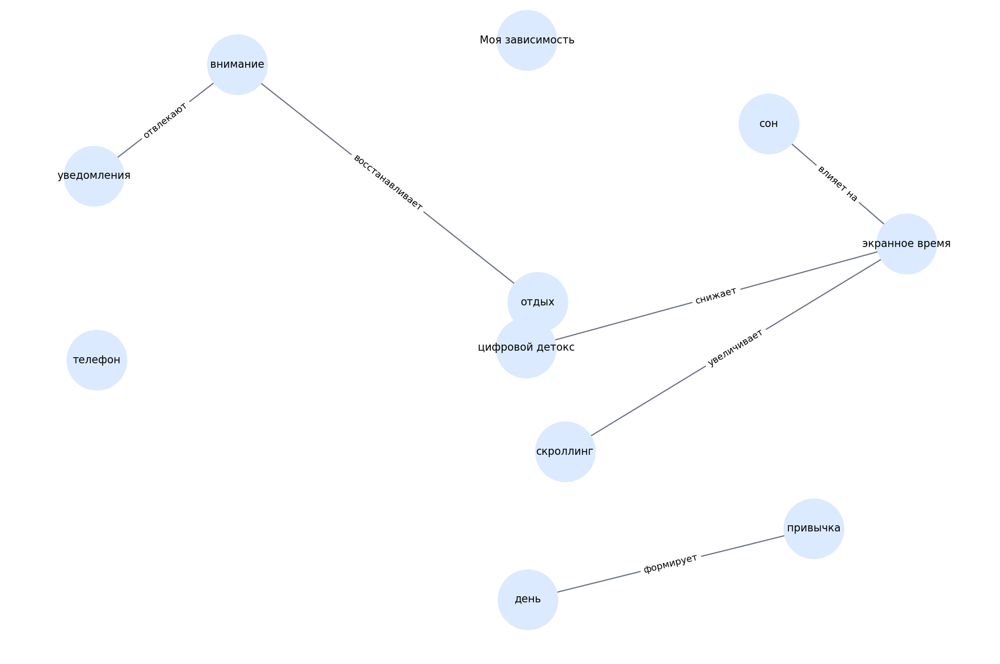

# Моя зависимость

> Черновой шаблон README для темы. Блок «кто делал» оставлен под заполнение вручную.

## 1. Кто работал над темой

| Участник | Роль | Что делал | Статус |
|---|---|---|---|
| [Имя 1] | [Капитан / аналитик / редактор / разработчик / визуализатор] | [Кратко описать вклад] | [заполнить] |
| [Имя 2] | [Роль] | [Кратко описать вклад] | [заполнить] |
| [Имя 3] | [Роль] | [Кратко описать вклад] | [заполнить] |
| [Имя 4] | [Роль] | [Кратко описать вклад] | [заполнить] |
| [Имя 5] | [Роль] | [Кратко описать вклад] | [заполнить] |

## 2. О чём эта тема

Тема о внимании, экранном времени, привычках и цифровой перегрузке.

Ключевые слова:
экранное время, скроллинг, уведомления, сон, цифровой детокс

## 3. Какие статьи входят в тему

- `ekrannoe_vremya.md` — Экранное время: сколько я реально в телефоне
- `skrolling_i_dofamin.md` — Скроллинг без цели: почему это ловушка
- `telefon_pered_snom.md` — Телефон перед сном: что происходит с мозгом
- `cifrovoi_detoks.md` — Цифровой детокс — это пытка или кайф
- `priznaki_peregruza_ot_seti.md` — Как понять, что пора отдохнуть от сети

## 4. Схема связей внутри темы

Текстовое описание:
- **скроллинг** → **экранное время** (увеличивает)
- **уведомления** → **внимание** (отвлекают)
- **экранное время** → **сон** (влияет на)
- **цифровой детокс** → **экранное время** (снижает)
- **привычка** → **день** (формирует)
- **отдых** → **внимание** (восстанавливает)

## 5. Связи с другими темами раздела

- Я и цифровой мир — входит в раздел
- Моя информационная гигиена — связана через внимание и уведомления
- Моя реальность/виртуальность — связана через баланс онлайн и офлайна

## 6. Примеры запросов

Файл с запросами: `scripts/sparql_queries.py`

Ниже — черновые направления запросов:
- `screen time`
- `smartphone`
- `sleep`
- `attention`
- `digital detox`

## 7. Где лежат рабочие материалы

- `concepts.json` — список статей и ключевых понятий темы
- `images/ontology.png` — схема темы
- `scripts/sparql_queries.py` — черновые SPARQL-запросы
- `data/wikidata_export.json` — шаблон выгрузки, который нужно заменить реальными данными

## 8. Процесс работы

1. Выделена тема внутри раздела.
2. Составлен первичный список статей.
3. Выделены основные понятия и связи.
4. Подготовлены черновые тексты.
5. Подготовлены шаблоны запросов и место под выгрузку.

## 9. Что ещё нужно уточнить

- [ ] Проверить состав статей
- [ ] Выполнить запросы к WikiData / DBpedia
- [ ] При необходимости изменить связи
- [ ] Добавить изображения, примеры и ссылки в тексты
- [ ] Вычитать стиль для возраста 10+

## 10. Личные ощущения от работы

> Заполнить после завершения этапа:
>
> - [Имя]: ...
> - [Имя]: ...
> - [Имя]: ...
